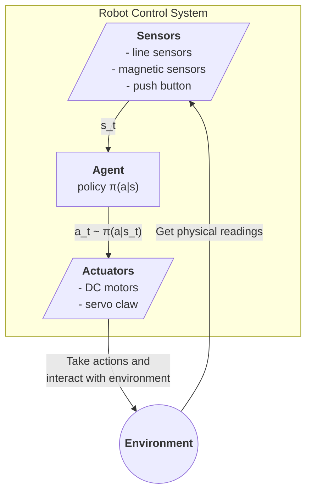

# Autonomous Guided Vehicle for Package Delivery

An Arduino-based autonomous delivery robot that navigates a toy environment to collect and deliver packages to designated locations.

## System Overview

### System Diagram

### Pin Connections

| Component | Pin(s) |
|-----------|--------|
| Line Sensors | Front Left (7), Back (9), Left (10), Right (11), Front Right (12) |
| Magnetic Sensor | 6 | 
| DC Motors | Left (2), Right (3) |
| Servo Claw | 13 |
| LED Indicators | Blue (4), Red (3), Green (1) |
| Push Button | 5 |

## Code Structure

The codebase follows an object-oriented design with three main classes:

### Sensor Class

- Manages line and magnetic sensor readings
- Maintains buffer of historical sensor values
- Line sensor setup:

### Actuator Class
- Controls DC motors for movement
- Operates servo motor for claw
- Manages LED indicators
- Implements low-level motor actions:
  - Forward/backward steps  
  - Left/right turns
  - Straight line movement

### Agent Class
- Core decision-making module
- Maps sensor states to actuator commands  
- Implements high-level navigation strategy

### Navigation Strategy

1. Robot follows predefined paths stored in `allPaths` matrix

2. Each path contains sequence of junction decisions:
    - `turn_forward_right/left`: Turn at T-junctions
    - `step_forward/backward`: Move straight  
    - `straight_forward`: Extended forward movement
    
3. Junction detection:
    - Uses line sensor buffer to confirm consistent readings
    - Increments junction counter when validated 
    - Executes corresponding decision at that junction

4. Line following:
    - Error correction based on front sensors

5. Package handling: 
    - Magnetic sensor detects package properties
    - LED indicators show package state
    - Servo claw for pickup/delivery

## Development Environment

This project uses `PlatformIO` as the development environment. PlatformIO is an open-source ecosystem for IoT development, industry standard in embedded systems. We use the `PlatformIO` plugin for `VSCode`, so that we can compile and build files from `VSCode`.

### platformio

Compared to a project without `platformio`, the main difference is the `platformio.ini` file which provides the key configurations for our project.

- `lib_deps` parameter specifies all the libraries that we'll use in our projects
- `upload_port` specifies which port of the computer we'll use to connect to the Arduino board, this is usually set automatically but may need to be configured depending on your system

### Importing core libraries

Since we're not using the Arduino IDE, we'll have to import libraries ourselves using `#include` in the `main` file.

## Extra Notes

- Different motor have different speeds
- Thinking blue crosses are junctions
- `Serial.Print` causes major lags, remove these in the loops
  - After line sensing, delayed action to motors
  - Use a buffer to make readings consistent before making a decision
- Added a double check whenever we encounter `|-` or `-|` junctions, make sure its not a cross
- Be careful about using `delay`! Delay makes it continue the previous action for some time, NOT stop the robot
- Make sure when you upload code or press the reset button, to disconnect the servo AND the motor
  - Otherwise the servo will do a 270deg turn